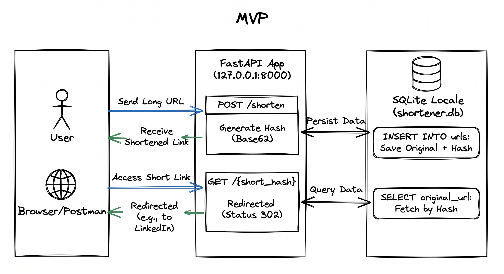

# 🚀 URL Shortener: System Design in Practice

A practical project building a highly available URL shortener that scales from 1 to 1,000,000+ users. 

This repository demonstrates a complete software engineering lifecycle focused on intentional architecture and real-world practices:

* **📏 Measure:** Defining strict latency SLOs (P95/P99).
* **🧠 Plan:** Documenting trade-offs via Architecture Decision Records (ADRs).
* **🏗️ Build:** Orchestrating FastAPI, PostgreSQL, Redis, and Docker.
* **🧪 Validate:** Load testing with Locust to prove resilience and handle side effects.

## 📈 Architecture Evolution

The system grows in 3 main phases:

1. **[Phase 1 (MVP - up to 1k users)](./1_mvp/):** Basic API + Relational Database. Focus on the Base62 algorithm and database structure.
2. **[Phase 2 (10k to 100k users)](./2_caching/):** Addition of a Load Balancer, Multiple API Instances, and Cache (Redis).
3. **[Phase 3 (1M+ users)](./3_scale/):** Database Read Replicas, Distributed ID Service, and Rate Limiter.

## 🛠️ Tech Stack

* **Backend:** Python (FastAPI and Django)
* **Main Database:** SQLite, PostgreSQL
* **Cache & Proxy:** Redis, Nginx
* **Infrastructure:** Docker & Docker Compose

## 🗺️ Development Roadmap

### 🟢 Phase 1: MVP (Up to 1,000 users)
```bash
# Create the environment
python -m venv venv

# Active the environment
source venv/bin/activate

# Run the server
fastapi dev main.py

# Init db
python database.py

# Execute the function
python base62.py
```

### 🟡 Phase 2: The First Bottleneck (10k to 100k users)
- [ ] **Task 1: Baseline Benchmark & ADR Setup (1h):** Run an initial load test (e.g., using Locust) on the current MVP to capture "before" screenshots of latency and throughput. Create the `docs/adrs/` directory and draft `ADR-001` (PostgreSQL migration).
- [ ] **Task 2: SLO Metrics & Middleware (1h):** Implement FastAPI middleware to log request latency, allowing us to actively measure our P95 (<400ms) and P99 (<150ms) targets.
- [ ] **Task 3: Dependencies & Env Vars (1h):** Update `requirements.txt` (add `psycopg2-binary`, `redis`, `python-dotenv`, `locust`) and setup the `.env` file for credentials.
- [ ] **Task 4: PostgreSQL Migration (1h):** Replace `sqlite3` with `psycopg2` in `main.py`, explicitly configuring connection timeouts to ensure fast failures.
- [ ] **Task 5: Redis ADR & Resilient Caching (1h):** Draft `ADR-002` (Redis caching strategy). Connect to Redis for the `GET` route to handle the 99% read traffic, ensuring a graceful fallback to the DB if the cache fails.
- [ ] **Task 6: API Dockerfile (1h):** Create a `Dockerfile` at the root of the project to package the Python code and FastAPI into a standardized image.
- [ ] **Task 7: Docker Compose Infrastructure (1h):** Create a `docker-compose.yml` file to spin up `postgres`, `redis`, and configure 2 simultaneous replicas of the FastAPI application.
- [ ] **Task 8: Nginx Load Balancer (1h):** Create an `nginx.conf` file to distribute traffic across the API replicas, adding the Nginx service to Docker Compose.
- [ ] **Task 9: Load Testing, E2E Verification & Review (1h):** Run Locust against the new infrastructure to capture "after" screenshots. Compare with the baseline, document any unexpected side effects or trade-offs, and verify if the SLOs are met.
...
- [ ] Desenho da arquitetura no Scalidraw, seguindo o padrão da imagem do mvp, focando nas rotas e insert e select separados na parte do db

### 🔴 Phase 3: Massive Scale (1M+ users)
- [ ] **Task 1: Baseline Stress Test & ADR Setup (1h):** Run an intensive Locust load test on the Phase 2 architecture to capture "before" failure points under massive traffic. Draft `ADR-003` (Distributed ID Generation) and `ADR-004` (Database Read/Write Replication).
- [ ] **Task 2: Redis Rate Limiter (1h):** Implement a Token Bucket algorithm middleware using Redis to limit `POST /shorten` requests per IP, preventing abuse and DDoS attacks.
- [ ] **Task 3: Distributed ID Generator (1h):** Replace the PostgreSQL `AUTOINCREMENT` with a highly available ID generation strategy (e.g., a Redis-backed Ticket Server or Snowflake) to remove the primary write bottleneck.
- [ ] **Task 4: PostgreSQL Replication (Infra) (1h):** Update the `docker-compose.yml` to deploy a PostgreSQL Master-Slave architecture, separating write nodes from read nodes.
- [ ] **Task 5: Read/Write Split Routing (1h):** Refactor the API database logic to route all `INSERT` operations to the Master DB and all `SELECT` operations to the Read Replica DB.
- [ ] **Task 6: Replication Lag Mitigation (1h):** Implement a fallback mechanism (Eventual Consistency handling) where if a freshly created link is not yet found in the Read Replica, the API temporarily checks the cache or Master DB.
- [ ] **Task 7: Final Stress Testing, Trade-off Analysis & Review (1h):** Run Locust again to capture "after" screenshots. Compare with the baseline, document side effects (e.g., eventual consistency impacts observed), validate the rate limiter, and ensure Read Replicas maintain the P99 < 150ms SLO.
...
- [ ] Desenho da arquitetura no Scalidraw, seguindo o padrão da imagem do mvp, focando nas rotas e insert e select separados na parte do db

### 🏗️ Architectural Evolution and Trade-offs

**Phase 1: MVP and Validation (Up to 1k users)**
The project's architecture was intentionally designed to balance delivery speed and product validation. In this initial stage, we prioritized simplicity and local consistency using SQLite. Our focus was on correctly structuring the shortening algorithm (Base62) and the redirection logic, without adding premature infrastructure complexity.



- TODO: Vídeo about use the MVP

**Phase 2: High Availability and SLOs (10k to 100k users)**
To support the first major traffic leap and respect our latency SLOs (P99 < 150ms for redirects), the infrastructure evolved into a distributed environment. We migrated to PostgreSQL to ensure safe concurrency, introduced Redis as a resilient caching layer to absorb the 99% read traffic, and adopted Nginx as a Load Balancer to orchestrate multiple Docker-containerized API instances.

**Phase 3: Global Scale (1M+ users)**
Facing massive traffic, we embraced eventual consistency to protect the system's integrity. We implemented database read replicas (Read/Write Split) to distribute the load, adopted a distributed ID generator to remove the primary database bottleneck, and shielded the API with a Redis-based Rate Limiter to prevent abuse, ensuring the application's continuous resilience.

## 🙌 Acknowledgments

A special thanks to my mentor, [Luke Berry](https://github.com/LukeberryPi), for the continuous guidance and for pushing me to be a better engineer. I also want to give a huge shoutout to [Jessica Felix](https://github.com/jessilyneh) for the invaluable architectural insights and support throughout this project's evolution. This system wouldn't be the same without you both!

---

## 👤 Author

<div align="center">
  Project developed by <a href="https://kecbm.vercel.app/">Klecianny Melo</a> 👩🏾‍💻 
</div>

</br>

If you liked this project, give it a ⭐ and feel free to reach out!
