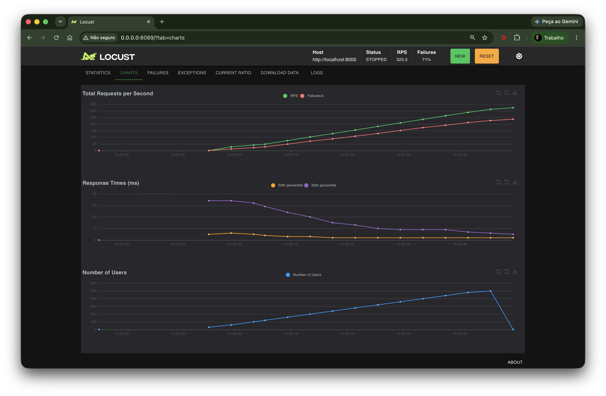

# ADR 001: Migration from SQLite to PostgreSQL

## Status
Accepted

## Context
The MVP of our URL shortener was built using SQLite to ensure agility and rapid validation of the business rules (Base62). However, as we enter Phase 2 of the project, aiming to support between 10k and 100k concurrent users, SQLite became a bottleneck. Due to its single-file nature and database locks, it cannot support multiple API instances writing simultaneously, making horizontal scalability impossible.

### Bottleneck Evidence (Baseline)
The initial load test (using Locust) with 500 concurrent users demonstrated the limits of the current architecture, showing response time degradation due to SQLite database locks:

## Decision
We decided to migrate the primary database from SQLite to PostgreSQL.

## Consequences
* **Positive:** We will gain native support for high concurrency and be able to horizontally scale the FastAPI application across multiple Docker containers behind a Load Balancer (Nginx) without the risk of database locks.
* **Negative (Trade-offs):** Increased infrastructure complexity. We will need to manage network connections and introduce Docker Compose to orchestrate the database locally.